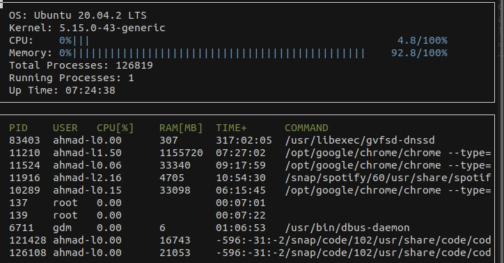

# System-Monitor

System Monitor is a Terminal Program that displays System's and Process's Information. This Program is mainly built on parsing the Linux provided directories that documents all systems information, `/proc/` and `/etc/` Directories, which is similar to **htop**, a famous Linux application which inspired this entire project. This Project can only run on Linux Systems

## ncurses

[ncurses](https://www.gnu.org/software/ncurses/) is a library that facilitates text-based graphical output in the terminal. This project relies on ncurses for display output.

Within the Udacity Workspace, `.student_bashrc` automatically installs ncurses every time you launch the Workspace.

If you are not using the Workspace, install ncurses within your own Linux environment: `sudo apt install libncurses5-dev libncursesw5-dev`

## Make
This project uses [Make](https://www.gnu.org/software/make/). The Makefile has four targets:
* `build` compiles the source code and generates an executable
* `format` applies [ClangFormat](https://clang.llvm.org/docs/ClangFormat.html) to style the source code
* `debug` compiles the source code and generates an executable, including debugging symbols
* `clean` deletes the `build/` directory, including all of the build artifacts

## Instructions

In order to use System-Monitor you have to create a clean build for the application following these commands : 

``` sh
## Clone System-Monitor Repository
git clone https://github.com/Ahmad-Abdalmageed/System-Monitor.git
cd System-Monitor

## Create a Clean Build
make clean 
make build

## Run the Program 
./build/monitor
```

***Note:*** Caught Chrome Eating my RAM :laughing:

